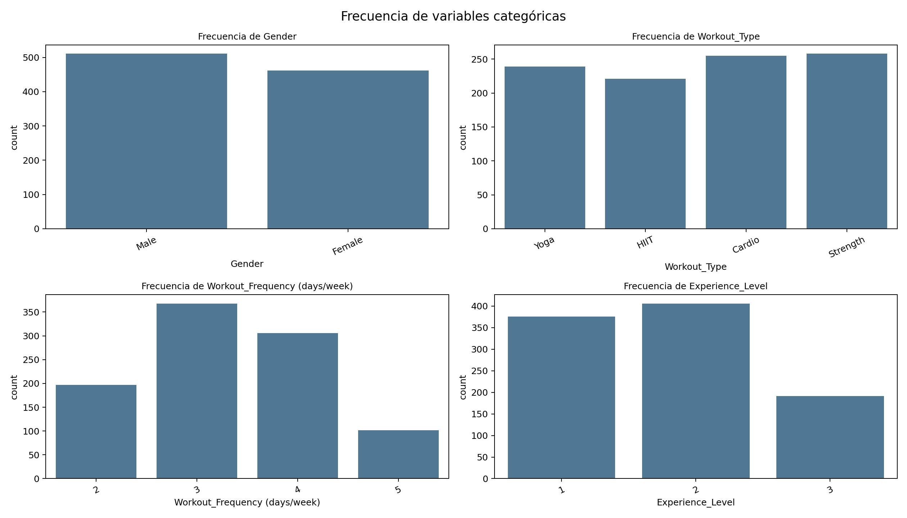
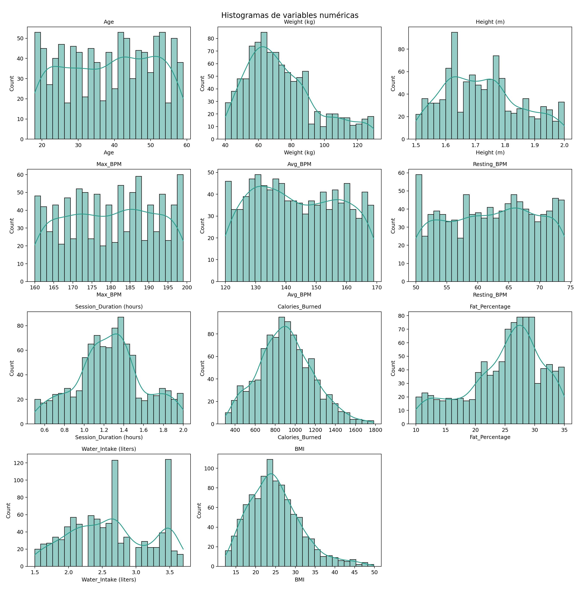
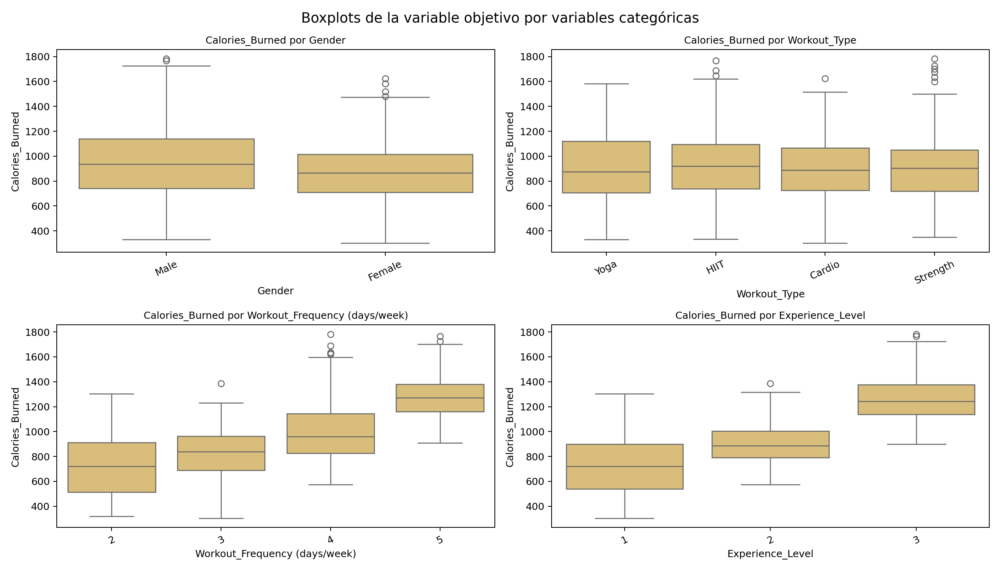
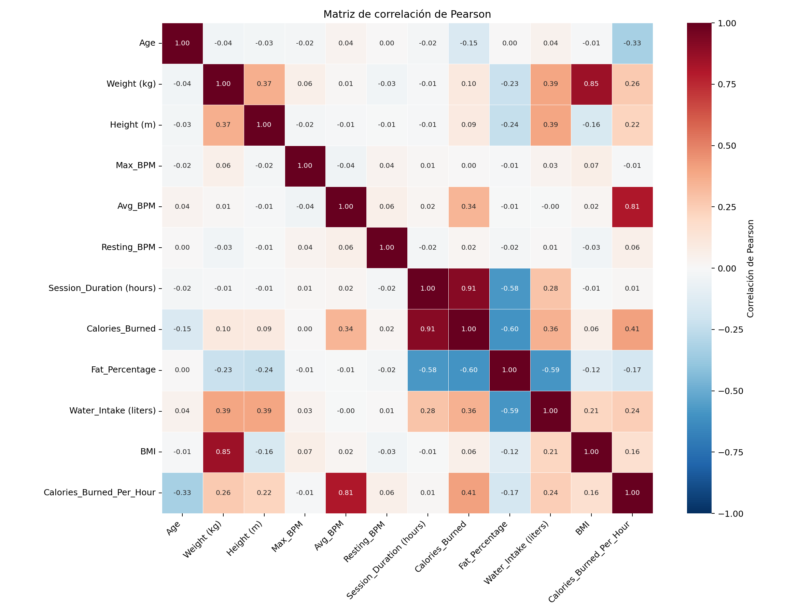
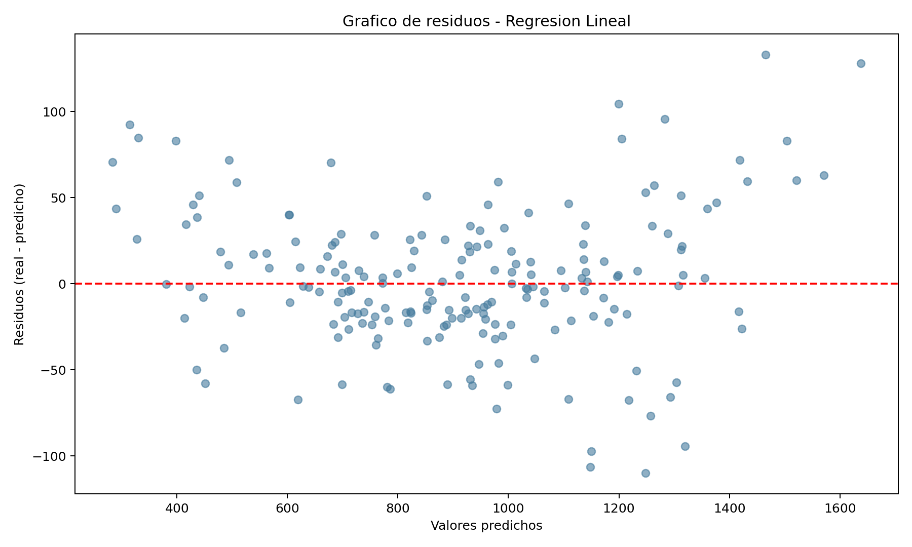

# Respuestas — Práctica Final: Análisis y Modelado de Datos

> Rellena cada pregunta con tu respuesta. Cuando se pida un valor numérico, incluye también una breve explicación de lo que significa.

---

## Ejercicio 1 — Análisis Estadístico Descriptivo
---
En este ejercicio se realiza un análisis descriptivo en tres niveles: primero, la caracterización estructural del dataset; segundo, el estudio univariante de las variables numéricas mediante medidas de tendencia central, dispersión y forma; y tercero, el análisis bivariante de la variable objetivo frente a variables categóricas y numéricas relevantes.

La evaluación de distribuciones se apoya en histogramas con curva KDE y en boxplots, mientras que la interpretación cuantitativa se sustenta en media, mediana, desviación típica, varianza, cuartiles e IQR. Además, se incluyen asimetría y curtosis para describir la forma de la distribución de la variable objetivo. Este enfoque permite justificar de forma estadística y transparente las decisiones posteriores de modelado.

**Subapartado: análisis de variables categóricas (frecuencias, gráficos y desbalance)**

Como complemento al análisis numérico, se evaluaron las cuatro variables categóricas detectadas mediante frecuencias absolutas/relativas y gráficos de barras, con el objetivo de comprobar si existe desbalance que pudiera condicionar la interpretación o el modelado posterior.

Resultados principales:
- **Gender:** Male 52.52% (511) y Female 47.48% (462). Distribución prácticamente equilibrada, sin categoría dominante.
- **Workout_Type:** Strength 26.52% (258), Cardio 26.21% (255), Yoga 24.56% (239), HIIT 22.71% (221). Reparto homogéneo entre tipos de entrenamiento.
- **Workout_Frequency (days/week):** 3 días 37.82% (368), 4 días 31.45% (306), 2 días 20.25% (197), 5 días 10.48% (102). Se observa mayor concentración en 3-4 días/semana, aunque sin dominancia extrema.
- **Experience_Level:** nivel 2 = 41.73% (406), nivel 1 = 38.64% (376), nivel 3 = 19.63% (191). Existe menor representación del nivel avanzado, pero dentro de un rango todavía analíticamente usable.

Interpretación de los gráficos de frecuencia:
- Los gráficos de barras confirman visualmente la ausencia de picos desproporcionados.
- No aparece ninguna categoría por encima del umbral de desbalance severo (60%), por lo que no hay evidencia de sesgo estructural fuerte.
- La ligera infrarepresentación de Experience_Level = 3 y de Workout_Frequency = 5 sugiere prudencia interpretativa en esos subgrupos, pero no justifica técnicas de corrección en esta fase descriptiva.

Conclusión del subapartado:
En conjunto, las variables categóricas presentan un comportamiento razonablemente balanceado. Por tanto, el análisis descriptivo es estable y no requiere, por ahora, estrategias de remuestreo o ponderación específicas por frecuencia de categoría.

---

**Pregunta 1.1** — ¿De qué fuente proviene el dataset y cuál es la variable objetivo (target)? ¿Por qué tiene sentido hacer regresión sobre ella?

> **Origen del dataset:**
> 
> El dataset proviene de [Kaggle: Gym Members Exercise Dataset](https://www.kaggle.com/datasets/valakhorasani/gym-members-exercise-dataset), una colección de datos reales sobre miembros de gimnasio y su actividad física. Contiene información detallada y características sobre el entrenamiento de 973 individuos.
> 
> **Características estructurales:**
>
> El dataset cumple con los requisitos especificados:
> - **Número de columnas:** 15 (requisito: 8+)
> - **Tamaño del archivo CSV:** 0.062 MB (requisito: <15 MB)
> - **Número de filas:** 973 observaciones
> - **Variables categóricas:** 4 (Gender, Workout_Type, Experience_Level, Workout_Frequency)
> - **Varibales continuas:** 7 (Weight(kg), Height(m), Session_Duration(h), Calories_Burned, Fat_Percentage, Water_Intake(l), BMI)
> - **Variable objetivo:** 1 (Calories_Burned)
> 
> **Composición de las variables:**
> 
> El dataset incluye 11 variables numéricas (de precisión continua o discreta): Age, Weight, Height, Max_BPM, Avg_BPM, Resting_BPM, Session_Duration, Fat_Percentage, Water_Intake, BMI y la variable objetivo Calories_Burned. Adicionalmente hay 4 variables categóricas:
> - **Gender (str):** Género del miembro (2 categorías)
> - **Workout_Type (str):** Tipo de entrenamiento realizado (cardio, fuerza, etc.)
> - **Experience_Level (int discreto, 1-3 niveles):** Tratada como categórica ordinal (principiante, intermedio, avanzado)
> - **Workout_Frequency (int discreto, 3-7 días/semana):** Días de entrenamiento por semana, tratada como categórica debido a su bajo número de valores únicos
> 
> **Variable objetivo (Target): Calories_Burned**
> 
> La variable objetivo es **Calories_Burned** (float64), que mide el número de calorías quemadas en cada sesión de entrenamiento. Es una variable **continua y no acotada**, lo que la hace ideal para regresión porque:
> 
> 1. **Naturaleza continua:** Puede tomar cualquier valor real positivo, no está restringida a categorías o valores discretos.
> 2. **Relación causal con características:** Existe una relación clara y lógica entre predictores (peso, duración de sesión, tipo de entrenamiento, frecuencia cardíaca) y calorías quemadas, haciendo que los coeficientes de regresión sean interpretables.
> 3. **Variabilidad capturada:** Los regresores disponibles explican una parte significativa de su varianza (especialmente Session_Duration, Weight y tipo de ejercicio).
> 4. **Aplicación práctica:** Predecir calorías quemadas es útil para el diseño de planes de entrenamiento personalizados y seguimiento de objetivos fitness.

**Pregunta 1.2** — ¿Qué distribución tienen las principales variables numéricas y has encontrado outliers? Indica en qué variables y qué has decidido hacer con ellos.

> El análisis descriptivo de las variables numéricas muestra, en términos generales, distribuciones razonablemente estables, con distinta dispersión según la naturaleza de cada variable y sin evidencia de valores extremos problemáticos en la mayoría de los casos.
>
> **1) Estadísticos descriptivos e interpretación por grupos de variables**
>
> **Edad y variables fisiológicas de BPM**
> - **Age:** media 38, mediana 40, desviación típica 12.1809, IQR = 21. Se observa una dispersión moderada, con centro claro en torno a 40 años.
> - **Max_BPM:** media 179.8839, mediana 180, desviación típica 11.5257, IQR = 20.
> - **Avg_BPM:** media 143.7667, mediana 143, desviación típica 14.3451, IQR = 25.
> - **Resting_BPM:** media 62.2230, mediana 62, desviación típica 7.3271, IQR = 12.
> 
> En las cuatro variables, media y mediana son muy próximas, lo que sugiere distribuciones cercanas a simétricas y sin sesgos severos. Además, los rangos observados son coherentes con contextos de entrenamiento físico, por lo que no aparecen señales de valores anómalos estructurales.
>
> **Antropometría y composición corporal**
> - **Weight (kg):** media 73.8547, mediana 70, desviación típica 21.2075, IQR = 27.9.
> - **Height (m):** media 1.7226, mediana 1.71, desviación típica 0.1277, IQR = 0.18.
> - **BMI:** media 24.9121, mediana 24.16, desviación típica 6.6609, IQR = 8.45.
> - **Fat_Percentage:** media 24.9768, mediana 26.20, desviación típica 6.2594, IQR = 8.0.
> 
> En peso e IMC se aprecia mayor heterogeneidad entre individuos (desviaciones más altas), algo esperable en una muestra amplia de usuarios de gimnasio con perfiles distintos. Altura presenta menor variabilidad relativa, como era esperable. En grasa corporal, la mediana supera a la media, lo que sugiere un leve sesgo hacia valores bajos en parte de la muestra.
>
> **Carga de entrenamiento y resultado energético**
> - **Session_Duration (hours):** media 1.2564, mediana 1.26, desviación típica 0.3430, IQR = 0.42.
> - **Water_Intake (liters):** media 2.6266, mediana 2.60, desviación típica 0.6002, IQR = 0.90.
> - **Calories_Burned (target):** media 905.4224, mediana 893, desviación típica 272.6415, IQR = 356.
> 
> La duración de sesión y la ingesta de agua muestran variabilidad moderada. La variable objetivo presenta mayor dispersión absoluta (std alta e IQR amplio), lo cual es consistente con la combinación de perfiles físicos y rutinas diferentes.
>
> **2) Forma de la distribución de la variable objetivo**
>
> Para **Calories_Burned**:
> - **IQR:** 356.0000
> - **Asimetría (skewness):** 0.2783
> - **Curtosis:** -0.0560
>
> Interpretación:
> - La asimetría positiva es leve, por lo que la distribución está casi centrada pero con una cola derecha moderada.
> - La curtosis cercana a 0 indica forma próxima a mesocúrtica (similar a una normal en concentración y colas), sin colas extremadamente pesadas.
> - En conjunto, la variable objetivo no presenta una deformación severa y mantiene buena calidad para modelado de regresión.
>
> **3) Lectura de histogramas con KDE**
>
> Los histogramas con KDE confirman lo observado en los estadísticos:
> - **Age, BPM y Height** muestran perfiles bastante equilibrados, sin picos extremos aislados.
> - **Weight y BMI** presentan mayor extensión de la cola derecha, coherente con algunos individuos de mayor masa corporal.
> - **Session_Duration** se concentra alrededor de 1.2-1.4 h, con colas contenidas.
> - **Calories_Burned** tiene forma aproximadamente unimodal, centro alrededor de 850-950 y ligera cola a la derecha.
>
> **4) Boxplots de Calories_Burned por variables categóricas**
>
> Hallazgos más relevantes:
> - **Gender:** distribución relativamente similar entre grupos, con medianas cercanas y ligera diferencia a favor de hombres.
> - **Workout_Type:** las medianas son próximas entre tipos, con cierta ventaja de HIIT/Strength y dispersión comparable.
> - **Workout_Frequency (days/week):** patrón claramente creciente de la mediana al aumentar la frecuencia (2, 3, 4, 5 días), lo que aporta evidencia de relación positiva entre frecuencia semanal y gasto calórico por sesión.
> - **Experience_Level:** gradiente muy marcado (1 < 2 < 3) tanto en mediana como en nivel general, indicando que mayor experiencia se asocia con mayor gasto calórico por sesión.
>
> Este último punto es especialmente valioso porque sugiere señal predictiva real en variables categóricas ordinales, no solo en variables continuas.
>
> **5) Detección de outliers y decisión metodológica**
>
> A partir de la forma de las distribuciones (en general cercanas a simétricas y sin colas extremas severas), se optó por **Z-score** para la detección de outliers, ya que resulta coherente cuando la dispersión está bien representada por media y desviación típica.
>
> Resumen de outliers detectados:
> - **BMI:** 10 casos (1.03%), límites [4.9295, 44.8948]
> - **Calories_Burned:** 3 casos (0.31%), límites [87.4979, 1723.3470]
> - **Resto de variables:** 0 casos
>
> **Decisión adoptada:** no se elimina ni transforma ningún outlier.
>
> **Justificación:**
> - El porcentaje detectado es muy bajo (solo 1.03% en BMI y 0.31% en target).
> - Los valores se mantienen dentro de rangos plausibles para población activa de gimnasio.
> - Eliminar esos casos podría reducir variabilidad real y sesgar el modelo hacia perfiles medios, perdiendo capacidad de generalización en usuarios extremos pero reales.
> - Dado que no hay evidencia de error de medición ni ruptura estructural de la distribución, conservarlos aporta más valor analítico que descartarlos.

**Pregunta 1.3** — ¿Qué tres variables numéricas tienen mayor correlación (en valor absoluto) con la variable objetivo? Indica los coeficientes.
>
> Las tres variables numéricas con mayor correlación absoluta respecto a **Calories_Burned** son:
>
> 1. **Session_Duration (hours):** $r = 0.9081$
> 2. **Fat_Percentage:** $r = -0.5976$ (en valor absoluto, $|r| = 0.5976$)
> 3. **Water_Intake (liters):** $r = 0.3569$
>
> **Interpretación:**
> - **Session_Duration (hours)** presenta una correlación positiva muy alta con la variable objetivo, lo que indica que, en promedio, sesiones más largas se asocian claramente con mayor gasto calórico.
> - **Fat_Percentage** muestra una correlación negativa moderada-alta: a mayor porcentaje de grasa corporal, menor tendencia a quemar calorias por sesión, manteniendo el resto de factores sin controlar.
> - **Water_Intake (liters)** tiene una correlación positiva moderada, coherente con perfiles de entrenamiento más intensos o de mayor duración.
>
> El heatmap es consistente con estos resultados y permite identificar con claridad tanto la intensidad como el signo de las relaciones.
>
> **Multicolinealidad (umbral $|r| > 0.9$):**
> - Se detecta el par **Session_Duration (hours) vs Calories_Burned** con $r = 0.9081$.
>
> Este resultado confirma una relación muy fuerte entre una variable predictora y el target (lo cual es deseable para predicción). En cambio, no se observan pares de predictores con $|r| > 0.9$, por lo que no hay evidencia de multicolinealidad severa entre variables explicativas en este criterio.

**Pregunta 1.4** — ¿Hay valores nulos en el dataset? ¿Qué porcentaje representan y cómo los has tratado?

> No se detectaron valores nulos en el dataset. El porcentaje de nulos por columna es **0.0%** en las 15 variables (incluida la variable objetivo), por lo que el porcentaje total de datos faltantes también es **0%**.
>
> En consecuencia, no fue necesario aplicar técnicas de tratamiento de nulos (eliminación de registros, imputación estadística ni imputación basada en modelos). Esto es positivo para la calidad del análisis, ya que evita introducir sesgos por imputación y permite trabajar directamente con el conjunto completo de 973 observaciones.

---

## Ejercicio 2 — Inferencia con Scikit-Learn

---
En este ejercicio se construye un modelo de regresión lineal para predecir **Calories_Burned** y se evalúa su capacidad de generalización sobre datos no vistos. El objetivo no es solo reportar métricas, sino validar que el pipeline de preprocesamiento sea coherente con la naturaleza de las variables y con los hallazgos del Ejercicio 1.

**Estrategia de preprocesamiento y justificación**

1. **Separación de tipos de variables**
Se detectaron variables numéricas y categóricas siguiendo el mismo criterio del Ejercicio 1. Por lo tanto, se trataron como categóricas las variables numéricas discretas de pocos niveles (**Experience_Level** y **Workout_Frequency (days/week)**), ya que representan niveles/estados más que magnitudes continuas.

2. **Codificación de variables categóricas**
Se aplicó **OneHotEncoder** para convertir las categorías en variables binarias sin imponer un orden artificial. Esta decisión es especialmente adecuada para un modelo lineal, ya que permite estimar efectos diferenciados por categoría. No se opto por **LabelEncoder** debido a que asigna enteros (0, 1, 2, ...) y puede introducir una relación ordinal ficticia entre categorías nominales (por ejemplo, HIIT > Yoga), algo que distorsiona la interpretación en regresión lineal. Ni tampoco se uso **get_dummies** de pandas, ya que aunque también genera dummies, OneHotEncoder se integra mejor dentro de pipelines con ColumnTransformer y evita fugas de información entre train/test.

3. **Escalado de variables numéricas**
Se utilizó **StandardScaler** sobre las variables numéricas. En regresión lineal no cambia la calidad predictiva de forma drástica, pero sí estabiliza la escala entre predictores y hace comparables los coeficientes estandarizados dentro del pipeline. **StandardScaler** centra y escala con media/desviación típica, lo que suele funcionar mejor cuando las variables tienen distribución aproximadamente continua y sin límites naturales estrictos. En cambio, **MinMaxScaler** normaliza a un rango [0, 1], lo que puede ser útil para algoritmos basados en distancias o con sensibilidad a la escala, pero en este caso no aporta ventajas claras y puede ser más sensible a valores extremos. Dado que en este dataset existen algunos outliers plausibles (pocos, pero presentes), StandardScaler ofrece una transformación más estable para este caso.

4. **Columnas incluidas/excluidas**
No se eliminaron columnas por falta de información, ya que todas las variables disponibles tienen interpretación sustantiva en el contexto de gasto calórico (demografía, condición física, intensidad y hábitos de entrenamiento). Se mantuvo **remainder="drop"** para evitar columnas no definidas en el transformador.

5. **Partición Train/Test**
Se aplicó **train_test_split(..., test_size=0.2, random_state=42)**:
- Total: 973 filas
- Train: 778 filas (80%)
- Test: 195 filas (20%)

Esta partición permite entrenar con suficiente información y reservar un bloque robusto para evaluar el modelo.

6. **Estructura final del preprocesador**
Se implementó un **ColumnTransformer** con:
- Rama numérica: StandardScaler sobre 10 variables numéricas
- Rama categórica: OneHotEncoder sobre 4 variables categóricas

Con esta configuración, el pipeline queda reproducible, trazable y alineado con buenas prácticas de inferencia supervisada.

---

**Pregunta 2.1** — Indica los valores de MAE, RMSE y R² de la regresión lineal sobre el test set. ¿El modelo funciona bien? ¿Por qué?

> **Métricas en test (n = 195):**
> - **MAE:** 30.3485
> - **RMSE:** 40.6043
> - **R²:** 0.9802
>
> **Métricas en train (n = 778):**
> - **MAE:** 29.5852
> - **RMSE:** 38.9085
> - **R²:** 0.9790
>
> **Evaluación del rendimiento del modelo**
>
> El modelo funciona **muy bien**. El valor de $R^2 = 0.9802$ en test indica que explica aproximadamente el 98% de la variabilidad de la variable objetivo en datos no vistos. Además, los errores absolutos y cuadráticos (MAE y RMSE) son bajos en relación con la escala de **Calories_Burned** observada en el Ejercicio 1.
>
> La comparación train vs test no muestra señales de **overfitting** ni de **underfitting**:
> - **No overfitting:** si existiera sobreajuste, esperaríamos métricas claramente mejores en train que en test. Aquí las diferencias son pequeñas y estables (MAE: 29.5852 vs 30.3485; RMSE: 38.9085 vs 40.6043; $R^2$: 0.9790 vs 0.9802), lo que indica buena generalización.
> - **No underfitting:** si existiera infraajuste, tanto train como test tendrían desempeño pobre (errores altos y $R^2$ bajo). En este caso, ambos conjuntos muestran ajuste alto y consistente.
>
> **Análisis del gráfico de residuos**
>
> El gráfico de residuos muestra una nube centrada en torno a 0 (línea horizontal), sin patrón curvilíneo dominante. Esto respalda que la estructura lineal captura adecuadamente la relación principal entre predictores y target. Se aprecia una dispersión algo mayor en valores predichos altos; este comportamiento es coherente con lo observado en el Ejercicio 1, donde **Calories_Burned** presentaba ligera cola a la derecha (asimetría positiva) y 3 outliers plausibles (0.31%, límites [87.4979, 1723.3470]). Por tanto, esa mayor dispersión en la zona alta parece asociada a la propia estructura del target más que a un fallo grave del modelo.
>
> **Variables más influyentes (magnitud de coeficientes)**
>
> Entre los coeficientes de mayor impacto aparecen:
> - **Session_Duration (hours):** +240.4092
> - **Avg_BPM:** +88.6157
> - **Age:** -40.3406
> - **Gender_Male / Gender_Female:** +/-39.7869
> - **BMI:** +22.4929
> - **Weight (kg):** -21.7642
>
> La variable más influyente es **Session_Duration (hours)**, lo cual es totalmente coherente con el Ejercicio 1, donde ya aparecía como la correlación más fuerte con el target ($r = 0.9081$). También encaja que variables relacionadas con intensidad/condición fisiológica (Avg_BPM, composición corporal) contribuyan de forma relevante.
>
> **Análisis de sensibilidad sin Session_Duration (complementario)**
>
> Para comprobar si el rendimiento dependía en exceso de una sola variable, se estimó una variante del modelo excluyendo **Session_Duration (hours)**. El desempeño cayó de forma importante: en test, el $R^2$ pasó de **0.9802** a **0.6716**, el MAE de **30.35** a **134.99** y el RMSE de **40.60** a **165.53**.
>
> Esta caída confirma que Session_Duration aporta una señal predictiva central, algo esperable por la propia lógica del problema (a mayor tiempo de entrenamiento, mayor gasto calórico). No obstante, el experimento también permite extraer información útil: al retirar esa variable, ganan peso relativo otros predictores como **Experience_Level**, **Avg_BPM** y **Age**, que ayudan a interpretar factores secundarios del gasto energético.
>
> **Conexión con el Ejercicio 1**
>
> Los hallazgos del análisis descriptivo fueron clave para interpretar el resultado del modelo:
> - La fuerte relación entre duración de sesión y calorías (detectada en correlaciones y boxplots) anticipaba un modelo con alta capacidad explicativa.
> - La ausencia de nulos y el bajo nivel de outliers facilitaron un entrenamiento estable sin necesidad de imputaciones ni depuraciones agresivas.
> - El comportamiento razonablemente balanceado de las categóricas permitió codificación one-hot sin sesgos evidentes por clases dominantes.
>
> **Mejoras concretas propuestas**
>
> Dado el rendimiento actual (muy alto y estable), no son imprescindibles cambios estructurales. Como mejoras opcionales y realistas para este dataset:
>
> 1. Validar estabilidad con **K-Fold** para confirmar que el buen resultado no depende del split concreto.
> 2. Contrastar una variante con **Ridge** para comprobar si se mantiene el rendimiento con coeficientes algo más estables.
> 3. Reportar métricas por tramos de **Calories_Burned** (bajo/medio/alto) para verificar si la ligera mayor dispersión en valores altos afecta de forma práctica a un subgrupo concreto.

---

## Ejercicio 3 — Regresión Lineal Múltiple en NumPy

---
Añade aqui tu descripción y analisis:

---

**Pregunta 3.1** — Explica en tus propias palabras qué hace la fórmula β = (XᵀX)⁻¹ Xᵀy y por qué es necesario añadir una columna de unos a la matriz X.

> _Escribe aquí tu respuesta_

**Pregunta 3.2** — Copia aquí los cuatro coeficientes ajustados por tu función y compáralos con los valores de referencia del enunciado.

| Parametro | Valor real | Valor ajustado |
|-----------|-----------|----------------|
| β₀        | 5.0       |                |
| β₁        | 2.0       |                |
| β₂        | -1.0      |                |
| β₃        | 0.5       |                |

> _Escribe aquí tu respuesta_

**Pregunta 3.3** — ¿Qué valores de MAE, RMSE y R² has obtenido? ¿Se aproximan a los de referencia?

> _Escribe aquí tu respuesta_

---

## Ejercicio 4 — Series Temporales
---
Añade aqui tu descripción y analisis:

---

**Pregunta 4.1** — ¿La serie presenta tendencia? Descríbela brevemente (tipo, dirección, magnitud aproximada).

> _Escribe aquí tu respuesta_

**Pregunta 4.2** — ¿Hay estacionalidad? Indica el periodo aproximado en días y la amplitud del patrón estacional.

> _Escribe aquí tu respuesta_

**Pregunta 4.3** — ¿Se aprecian ciclos de largo plazo en la serie? ¿Cómo los diferencias de la tendencia?

> _Escribe aquí tu respuesta_

**Pregunta 4.4** — ¿El residuo se ajusta a un ruido ideal? Indica la media, la desviación típica y el resultado del test de normalidad (p-value) para justificar tu respuesta.

> _Escribe aquí tu respuesta_

---

*Fin del documento de respuestas*
