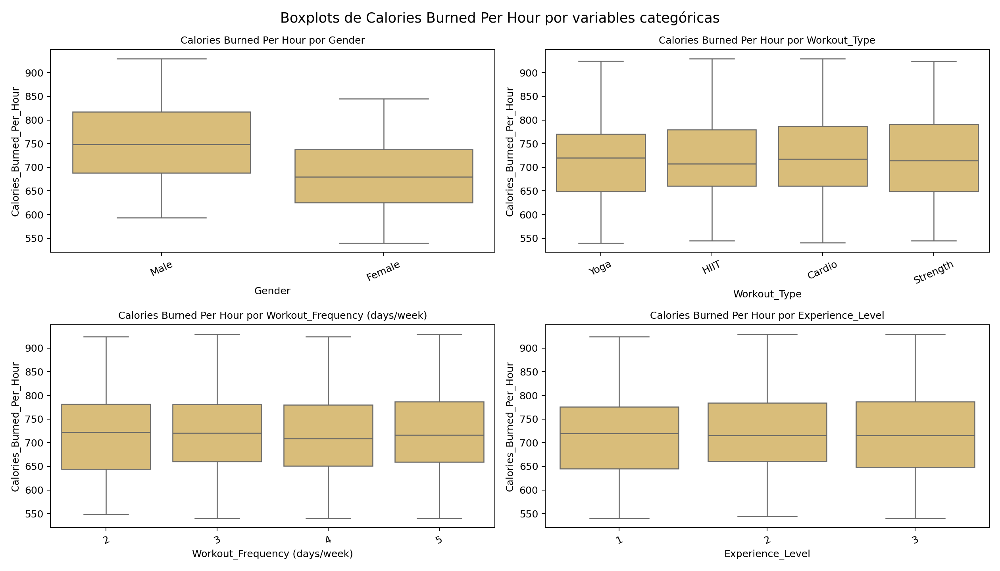
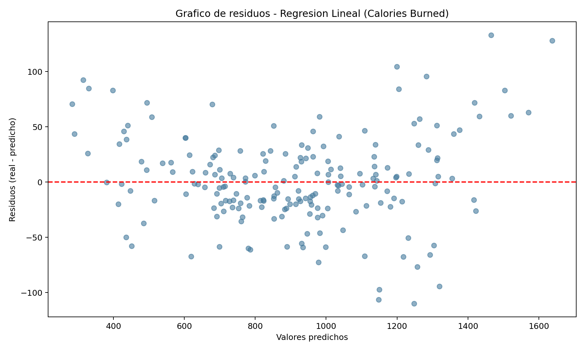
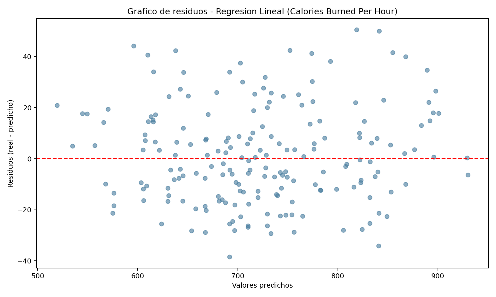

# Respuestas — Práctica Final: Análisis y Modelado de Datos

> Rellena cada pregunta con tu respuesta. Cuando se pida un valor numérico, incluye también una breve explicación de lo que significa.

---

## Ejercicio 1 — Análisis Estadístico Descriptivo
---

En este ejercicio se realiza un análisis descriptivo multinivel que incluye: caracterización estructural del dataset y composición de variables; evaluación del desbalance en categorías para identificar sesgos previos; estudio univariante de variables numéricas mediante tendencia central, dispersión y forma; análisis bivariante con visualización de distribuciones condicionales; detección de outliers; matriz de correlaciones de Pearson para identificar relaciones relevantes.

La evaluación de distribuciones se apoya en histogramas con curva KDE, boxplots y medidas de forma (asimetría, curtosis). La interpretación cuantitativa utiliza media, mediana, desviación típica, varianza, cuartiles e IQR. Este enfoque permite tomar decisiones posteriores de modelado sustentadas en evidencia estadística y conceptual.

---

**Pregunta 1.1** — ¿De qué fuente proviene el dataset y cuál es la variable objetivo (target)? ¿Por qué tiene sentido hacer regresión sobre ella?

> **Origen del dataset:**
> 
> El dataset proviene de [Kaggle: Gym Members Exercise Dataset](https://www.kaggle.com/datasets/valakhorasani/gym-members-exercise-dataset), una colección de datos reales sobre miembros de gimnasio y su actividad física. Contiene información detallada y características sobre el entrenamiento de 973 individuos.
> 
> **Características estructurales:**
>
> El dataset cumple con los requisitos especificados:
> - **Número de columnas:** 15 (requisito: 8+)
> - **Tamaño del archivo CSV:** 0.062 MB (requisito: <15 MB)
> - **Número de filas:** 973 observaciones
> - **Variables categóricas:** 4 (Gender, Workout_Type, Experience_Level, Workout_Frequency)
> - **Variables numéricas:** 11 (Age, Weight, Height, Max_BPM, Avg_BPM, Resting_BPM, Session_Duration, Calories_Burned, Fat_Percentage, Water_Intake, BMI)
> - **Variable objetivo:** 1 (Calories_Burned)
> 
> **Composición de las variables:**
> 
> El dataset incluye 11 variables numéricas (de precisión continua o discreta): Age, Weight, Height, Max_BPM, Avg_BPM, Resting_BPM, Session_Duration, Fat_Percentage, Water_Intake, BMI y la variable objetivo **Calories_Burned**. Adicionalmente hay 4 variables categóricas:
> - **Gender (str):** Género del miembro (2 categorías: Male, Female)
> - **Workout_Type (str):** Tipo de entrenamiento realizado (4 categorías: Cardio, Strength, Yoga, HIIT)
> - **Experience_Level (int discreto, 1-3 niveles):** Tratada como categórica ordinal (principiante, intermedio, avanzado)
> - **Workout_Frequency (int discreto, días/semana):** Días de entrenamiento por semana, tratada como categórica debido a su bajo número de valores únicos
> 
> **Variable objetivo (Target): Calories_Burned**
> 
> La variable objetivo es **Calories_Burned** (float64), que mide el número de calorías quemadas en cada sesión de entrenamiento. Es una variable **continua y no acotada**, lo que la hace ideal para regresión porque:
> 
> 1. **Naturaleza continua:** Puede tomar cualquier valor real positivo, no está restringida a categorías o valores discretos.
> 2. **Relación causal con características:** Existe una relación clara y lógica entre predictores (peso, duración de sesión, tipo de entrenamiento, frecuencia cardíaca) y calorías quemadas, haciendo que los coeficientes de regresión sean interpretables.
> 3. **Variabilidad capturada:** Los regresores disponibles explican una parte significativa de su varianza (especialmente Session_Duration, Weight y tipo de ejercicio).
> 4. **Aplicación práctica:** Predecir calorías quemadas es útil para el diseño de planes de entrenamiento personalizados y seguimiento de objetivos fitness.

---

**Subapartado: Análisis de variables categóricas (frecuencias, gráficos y desbalance)**

Como complemento al análisis numérico, se evaluaron las cuatro variables categóricas detectadas mediante frecuencias absolutas/relativas y gráficos de barras, con el objetivo de comprobar si existe desbalance que pudiera condicionar la interpretación o el modelado posterior.

**Resultados principales:**
- **Gender:** Male 52.52% (511) y Female 47.48% (462). Distribución prácticamente equilibrada, sin categoría dominante.
- **Workout_Type:** Strength 26.52% (258), Cardio 26.21% (255), Yoga 24.56% (239), HIIT 22.71% (221). Reparto homogéneo entre tipos de entrenamiento.
- **Workout_Frequency (days/week):** 3 días 37.82% (368), 4 días 31.45% (306), 2 días 20.25% (197), 5 días 10.48% (102). Se observa mayor concentración en 3-4 días/semana, aunque sin dominancia extrema.
- **Experience_Level:** nivel 2 = 41.73% (406), nivel 1 = 38.64% (376), nivel 3 = 19.63% (191). Existe menor representación del nivel avanzado, pero dentro de un rango todavía analíticamente usable.

**Interpretación de los gráficos de frecuencia:**
- Los gráficos de barras confirman visualmente la ausencia de picos desproporcionados.
- No aparece ninguna categoría por encima del umbral de desbalance severo (60%), por lo que no hay evidencia de sesgo estructural fuerte.
- La ligera infrarepresentación de Experience_Level = 3 y de Workout_Frequency = 5 sugiere prudencia interpretativa en esos subgrupos, pero no justifica técnicas de corrección en esta fase descriptiva.

**Conclusión del subapartado:**
En conjunto, las variables categóricas presentan un comportamiento razonablemente balanceado. Por tanto, el análisis descriptivo es estable y no requiere, por ahora, estrategias de remuestreo o ponderación específicas por frecuencia de categoría.

---

**Pregunta 1.2** — ¿Qué distribución tienen las principales variables numéricas y has encontrado outliers? Indica en qué variables y qué has decidido hacer con ellos.

> El análisis descriptivo de las variables numéricas muestra, en términos generales, distribuciones razonablemente estables, con distinta dispersión según la naturaleza de cada variable y sin evidencia de valores extremos problemáticos en la mayoría de los casos.
>
> **1) Estadísticos descriptivos e interpretación por grupos de variables**
>
> **Edad y variables fisiológicas de BPM**
> - **Age:** media 39, mediana 40, desviación típica 12.18, IQR = 21. Se observa una dispersión moderada, con centro claro en torno a 40 años.
> - **Max_BPM:** media 179.88, mediana 180, desviación típica 11.53, IQR = 20.
> - **Avg_BPM:** media 143.77, mediana 143, desviación típica 14.35, IQR = 25.
> - **Resting_BPM:** media 62.22, mediana 62, desviación típica 7.33, IQR = 12.
> 
> En las cuatro variables, media y mediana son muy próximas, lo que sugiere distribuciones cercanas a simétricas y sin sesgos severos. Además, los rangos observados son coherentes con contextos de entrenamiento físico, por lo que no aparecen señales de valores anómalos estructurales.
>
> **Antropometría y composición corporal**
> - **Weight (kg):** media 73.85, mediana 70, desviación típica 21.21, IQR = 27.9.
> - **Height (m):** media 1.72, mediana 1.71, desviación típica 0.13, IQR = 0.18.
> - **BMI:** media 24.91, mediana 24.16, desviación típica 6.66, IQR = 8.45.
> - **Fat_Percentage:** media 24.98, mediana 26.20, desviación típica 6.26, IQR = 8.0.
> 
> En peso e IMC se aprecia mayor heterogeneidad entre individuos (desviaciones más altas), algo esperable en una muestra amplia de usuarios de gimnasio con perfiles distintos. Altura presenta menor variabilidad relativa, como era esperable. En grasa corporal, la mediana supera a la media, lo que sugiere un leve sesgo hacia valores bajos en parte de la muestra.
>
> **Carga de entrenamiento y resultado energético**
> - **Session_Duration (hours):** media 1.26, mediana 1.26, desviación típica 0.34, IQR = 0.42.
> - **Water_Intake (liters):** media 2.63, mediana 2.60, desviación típica 0.60, IQR = 0.90.
> - **Calories_Burned (target):** media 905.42, mediana 893, desviación típica 272.64, IQR = 356.
> 
> La duración de sesión y la ingesta de agua muestran variabilidad moderada. La variable objetivo presenta mayor dispersión absoluta (std alta e IQR amplio), lo cual es consistente con la combinación de perfiles físicos y rutinas diferentes.
>
> **2) Forma de la distribución de la variable objetivo**
>
> Para **Calories_Burned**:
> - **IQR:** 356.0000
> - **Asimetría (skewness):** 0.2783
> - **Curtosis:** -0.0560
>
> Interpretación:
> - La asimetría positiva es leve, por lo que la distribución está casi centrada pero con una cola derecha moderada.
> - La curtosis cercana a 0 indica forma próxima a mesocúrtica (similar a una normal en concentración y colas), sin colas extremadamente pesadas.
> - En conjunto, la variable objetivo no presenta una deformación severa y mantiene buena calidad para modelado de regresión.
>
> **3) Lectura de histogramas con KDE**
>
>
> 
> Los histogramas con KDE confirman lo observado en los estadísticos:
> - **Age, BPM y Height** muestran perfiles bastante equilibrados, sin picos extremos aislados.
> - **Weight y BMI** presentan mayor extensión de la cola derecha, coherente con algunos individuos de mayor masa corporal.
> - **Session_Duration** se concentra alrededor de 1.2-1.4 h, con colas contenidas.
> - **Calories_Burned** tiene forma aproximadamente unimodal, centro alrededor de 850-950 y ligera cola a la derecha.
>
> **4) Boxplots de Calories_Burned por variables categóricas**
>
>
> 
> Hallazgos más relevantes:
> - **Gender:** distribución relativamente similar entre grupos, con medianas cercanas y ligera diferencia a favor de hombres.
> - **Workout_Type:** las medianas son próximas entre tipos, con cierta ventaja de HIIT/Strength y dispersión comparable.
> - **Workout_Frequency (days/week):** patrón claramente creciente de la mediana al aumentar la frecuencia (2, 3, 4, 5 días), lo que aporta evidencia de relación positiva entre frecuencia semanal y gasto calórico por sesión.
> - **Experience_Level:** gradiente muy marcado (1 < 2 < 3) tanto en mediana como en nivel general, indicando que mayor experiencia se asocia con mayor gasto calórico por sesión.
>
> Este último punto es especialmente valioso porque sugiere señal predictiva real en variables categóricas ordinales, no solo en variables continuas.
>
> **5) Detección de outliers y decisión metodológica**
>
> A partir de la forma de las distribuciones (en general cercanas a simétricas y sin colas extremas severas), se optó por **Z-score** para la detección de outliers, ya que resulta coherente cuando la dispersión está bien representada por media y desviación típica.
>
> **Resumen de outliers detectados:**
> - **BMI:** 10 casos (1.03%), límites [4.9295, 44.8948]
> - **Calories_Burned:** 3 casos (0.31%), límites [87.4979, 1723.3470]
> - **Resto de variables:** 0 casos
>
> **Decisión adoptada:** no se elimina ni transforma ningún outlier.
>
> **Justificación:**
> - El porcentaje detectado es muy bajo (solo 1.03% en BMI y 0.31% en target).
> - Los valores se mantienen dentro de rangos plausibles para población activa de gimnasio.
> - Eliminar esos casos podría reducir variabilidad real y sesgar el modelo hacia perfiles medios, perdiendo capacidad de generalización en usuarios extremos pero reales.
> - Dado que no hay evidencia de error de medición ni ruptura estructural de la distribución, conservarlos aporta más valor analítico que descartarlos.

---

**Pregunta 1.3** — ¿Qué tres variables numéricas tienen mayor correlación (en valor absoluto) con la variable objetivo? Indica los coeficientes.

>
> 
> Las tres variables numéricas con mayor correlación absoluta respecto a **Calories_Burned** son:
>
> 1. **Session_Duration (hours):** $r = 0.9081$
> 2. **Fat_Percentage:** $r = -0.5976$ (valor absoluto $|r| = 0.5976$)
> 3. **Water_Intake (liters):** $r = 0.3569$
>
> **Interpretación:**
> - **Session_Duration (hours)** presenta una correlación positiva muy alta con la variable objetivo, lo que indica que, en promedio, sesiones más largas se asocian claramente con mayor gasto calórico.
> - **Fat_Percentage** muestra una correlación negativa moderada-alta: a mayor porcentaje de grasa corporal, menor tendencia a quemar calorias por sesión, manteniendo el resto de factores sin controlar.
> - **Water_Intake (liters)** tiene una correlación positiva moderada, coherente con perfiles de entrenamiento más intensos o de mayor duración.
>
> El heatmap es consistente con estos resultados y permite identificar con claridad tanto la intensidad como el signo de las relaciones.
>
> **Multicolinealidad (umbral $|r| > 0.9$):**
> - Se detecta el par **Session_Duration (hours) vs Calories_Burned** con $r = 0.9081$.
>
> Este resultado confirma una relación muy fuerte entre una variable predictora y el target(lo cual es deseable para predicción). Sin embargo, esta correlación muy alta ha motivado la creación de una nueva variable derivada (ver próximo apartado) para enriquecer el análisis, ya que proporciona un nuevo ángulo de interpretación eliminando el componente "obvio" de la duración de sesión, cuanto más dure una sesión mayor será su gasto calórico.

**Pregunta 1.4** — ¿Hay valores nulos en el dataset? ¿Qué porcentaje representan y cómo los has tratado?

> No se detectaron valores nulos en el dataset. El porcentaje de nulos por columna es **0.0%** en las 15 variables (incluida la variable objetivo), por lo que el porcentaje total de datos faltantes también es **0%**.
>
> En consecuencia, no fue necesario aplicar técnicas de tratamiento de nulos (eliminación de registros, imputación estadística ni imputación basada en modelos). Esto es positivo para la calidad del análisis, ya que evita introducir sesgos por imputación y permite trabajar directamente con el conjunto completo de 973 observaciones.

---

## Apartado de Enriquecimiento: Variable Derivada Calories_Burned_Por_Hora

---

Tras completar el análisis descriptivo con la variable objetivo original (**Calories_Burned**), se identificó que su correlación muy alta con **Session_Duration (hours)** ($r = 0.9081$) hacía que los resultados de regresión estuvieran dominados por un efecto "obvio": sesiones más largas queman más calorías. 

Para obtener insights más profundos y desacoplar los efectos de la duración de la sesión, se creó una **variable derivada normalizada por duración**: 

$$\text{Calories\_Burned\_Por\_Hora} = \frac{\text{Calories\_Burned}}{\text{Session\_Duration (hours)}}$$

Esta nueva variable representa la **eficiencia metabólica** o **intensidad energética** de cada sesión, independientemente de cuánto tiempo haya durado. Con ella se puede responder preguntas como: "¿Qué factores relacionados con la persona, el tipo de entrenamiento o la experiencia determinan el gasto de calorías *por hora* de ejercicio?" De esta forma se eliminan las conclusiones obvias y se enfatizan factores más interesantes para la prescripción de entrenamiento personalizado.

---

**Análisis descriptivo de la variable Calories_Burned_Por_Hora**

**1) Indicadores de forma y dispersión:**
- **Media:** 720.42 cal/h
- **Mediana:** 715.27 cal/h
- **Desviación típica:** 86.94 cal/h
- **IQR:** 126.3889 cal/h
- **Asimetría (skewness):** 0.2460
- **Curtosis:** -0.5596

**Interpretación:**
- La media y mediana están muy cercanas (720 vs 715), lo que indica una distribución bastante simétrica, incluso con una asimetría ligeramente positiva pero muy leve (0.2460).
- La curtosis negativa (-0.5596) indica que la distribución es **platicúrtica** (colas más ligeras y perfil más plano que la normal), lo que sugiere ausencia de valores muy extremos y una dispersión más uniforme alrededor de la media.
- El IQR de 126.39 es proporcionalemente menor que el de Calories_Burned (356), lo que evidencia que normalizar por duración reduce variabilidad absoluta e introduce una estructura más homogénea.

**2) Histograma con KDE y comportamiento:**

Al observar el histograma de **Calories_Burned_Por_Hora** en la figura general de distribuciones numéricas, se aprecia:
- Forma aproximadamente **unimodal y simétrica**, sin colas extremas pronunciadas.
- Concentración principal entre 650-780 cal/h.
- Ausencia de multimodalidad, lo que sugiere que los datos forman una población relativamente homogénea en términos de intensidad metabólica por hora.
- Comparada con **Calories_Burned**, esta nueva variable tiene un perfil más "limpio" (menos influencia de la duración introducida artificialmente).

**3) Correlaciones con variables categóricas (Boxplots):**

**Hallazgos clave:**
- **Gender:** Hombres (Male) muestran mediana ligeramente superior (~750) vs mujeres (~680), indicando mayor gasto energético relativo por hora. Con respecto a Calories_Burned, la diferencia es más pronunciada. Esto sugiere que, aunque los hombres queman más calorías en total, también lo hacen de forma más eficiente por hora.
- **Workout_Type:** Los tipos siguen un un patron similar al observado en Calories_Burned, lo que quiere decir que la duración de la sesión esta equilibrada entre tipos de entrenamiento. LLama la atención que HIIT y Cardio tipos de entrenamiento enfocados en intensidad y gasto calorico no destacan sobre Strength y Yoga, lo que envidiencia el poder de estos últimos para generar gasto calórico.
- **Workout_Frequency:** Contraintuitivamente, la frecuencia parece tener poco efecto en la intensidad por hora (las cajas están muy superpuestas), lo que sugiere que entrenar más días no necesariamente implica mayor gasto energético *por sesión*. A diferencia de Calories_Burned, donde la frecuencia mostraba un patrón claro, aquí se diluye, lo que indica que el efecto de la frecuencia se manifiesta principalmente a través de la duración total de las sesiones.
- **Experience_Level:** La intensidad por hora no muestra diferencias tan claras entre niveles como en Calories_Burned, lo que sugiere que la experiencia influye más en la capacidad de mantener sesiones largas que en la eficiencia energética por hora.

**4) Correlaciones de Pearson revisadas:**

En la matriz de correlación expandida (incluida la nueva variable), se observa:
- **Correlación con Avg_BPM:** $r = 0.8105$ (muy fuerte)
- **Correlación con Calories_Burned:** $r = 0.4113$ (moderada, esperada por construcción)
- **Correlación con Age:** $r = -0.3343$ (valor absoluto $|r| = 0.3343$)

**Interpretación:** La nueva variable tiene una **correlación MUY fuerte con Avg_BPM** (frecuencia cardíaca promedio), lo cual es lógico: si el corazón late más rápido durante una sesión, es porque el ejercicio es más intenso, y por tanto se queman más calorías por hora. Tambien aparece una mayor correlación en Age, Weight y Height. Esto proporciona información biológicamente interpretable que antes estaba enmascarada por el efecto de la duración. A diferencia de Calories_Burned, donde el fat_percentage era el segundo predictor más relevante, aquí su correlación cae a 0.17, lo que sugiere que tenia mas que ver con la capacidad de mantener sesiones largas. Finalmente la correlación con Session_Duration cae a 0.01, lo que confirma que la normalización por duración ha reducido significativamente la dependencia entre ambas variables, permitiendo que el modelo de regresión capture otros factores relevantes.

---

## Ejercicio 2 — Inferencia con Scikit-Learn
---

En este ejercicio se construyen dos modelos de regresión lineal: uno para **Calories_Burned** y otro para la nueva variable **Calories_Burned_Por_Hora**. El objetivo es validar que ambos pipelines de preprocesamiento sean coherentes con la naturaleza de las variables y con los hallazgos del Ejercicio 1, permitiendo así comparar cómo la normalización por duración cambia la interpretabilidad de los predictores.

---

**Estrategia de preprocesamiento y justificación**

1. **Separación de tipos de variables**

Se detectaron variables numéricas y categóricas siguiendo el mismo criterio del Ejercicio 1. Por lo tanto, se trataron como categóricas las variables numéricas discretas de pocos niveles (**Experience_Level** y **Workout_Frequency (days/week)**), ya que representan niveles/estados más que magnitudes continuas.

2. **Codificación de variables categóricas**

Se aplicó **OneHotEncoder** para convertir las categorías en variables binarias sin imponer un orden artificial. Esta decisión es especialmente adecuada para un modelo lineal, ya que permite estimar efectos diferenciados por categoría. No se optó por **LabelEncoder** debido a que asigna enteros (0, 1, 2, ...) y puede introducir una relación ordinal ficticia entre categorías nominales (por ejemplo, HIIT > Yoga), algo que distorsiona la interpretación en regresión lineal. Ni tampoco se usó **get_dummies** de pandas, ya que aunque también genera dummies, OneHotEncoder se integra mejor dentro de pipelines con ColumnTransformer y evita fugas de información entre train/test.

3. **Escalado de variables numéricas**

Se utilizó **StandardScaler** sobre las variables numéricas. En regresión lineal no cambia la calidad predictiva de forma drástica, pero sí estabiliza la escala entre predictores y hace comparables los coeficientes estandarizados dentro del pipeline. **StandardScaler** centra y escala con media/desviación típica, lo que suele funcionar mejor cuando las variables tienen distribución aproximadamente continua y sin límites naturales estrictos. En cambio, **MinMaxScaler** normaliza a un rango [0, 1], lo que puede ser útil para algoritmos basados en distancias o con sensibilidad a la escala, pero en este caso no aporta ventajas claras y puede ser más sensible a valores extremos. Dado que en este dataset existen algunos outliers plausibles (pocos, pero presentes), StandardScaler ofrece una transformación más estable para este caso.

4. **Columnas incluidas/excluidas**
No se eliminaron columnas por falta de información, ya que todas las variables disponibles tienen interpretación sustantiva en el contexto de gasto calórico (demografía, condición física, intensidad y hábitos de entrenamiento). Se mantuvo **remainder="drop"** para evitar columnas no definidas en el transformador. Sin embargo, para el modelo con **Calories_Burned_Por_Hora**, se excluyeron de los predictores tanto **Calories_Burned** como **Session_Duration (hours)** para evitar fuga de información y obtener un modelo que capture factores intrínsecos de eficiencia (composición corporal, edad, género, experiencia) sin depender del cálculo directo de la variable derivada.

5. **Partición Train/Test**
Se aplicó **train_test_split(..., test_size=0.2, random_state=42)**:
- Total: 973 filas
- Train: 778 filas (80%)
- Test: 195 filas (20%)

Esta partición permite entrenar con suficiente información y reservar un bloque robusto para evaluar el modelo.

---

**Pregunta 2.1** — Indica los valores de MAE, RMSE y R² de la regresión lineal sobre el test set. ¿El modelo funciona bien? ¿Por qué?

> **Modelo 1: Calories_Burned**
>
> Métricas en test (n = 195):
> - **MAE:** 30.3485
> - **RMSE:** 40.6043
> - **R²:** 0.9802
>
> Métricas en train (n = 778):
> - **MAE:** 29.5852
> - **RMSE:** 38.9085
> - **R²:** 0.9790
>
> **Modelo 2: Calories_Burned_Por_Hora**
>
> Métricas en test (n = 195):
> - **MAE:** 15.4899
> - **RMSE:** 19.0610
> - **R²:** 0.9564
>
> Métricas en train (n = 778):
> - **MAE:** 16.4179
> - **RMSE:** 20.0323
> - **R²:** 0.9454
>
> ---
>
> **Evaluación del rendimiento de ambos modelos**
>
> **Ambos modelos funcionan muy bien.** Ambos superan un $R^2$ de 0.95 en test, lo que indica que explican más del 95% de la variabilidad en datos no vistos. Además, los errores absolutos y cuadráticos (MAE y RMSE) son bajos en relación con la escala de Calories_Burned y Calories_Burned_Por_Hora respectivamente, observada en el Ejercicio 1.
>
> La comparación train vs test no muestra señales de **overfitting** ni de **underfitting**:
> - **No overfitting:** si existiera sobreajuste, esperaríamos métricas claramente mejores en train que en test. Aquí las diferencias son pequeñas y estables (MAE: 29.5852 vs 30.3485; RMSE: 38.9085 vs 40.6043; $R^2$: 0.9790 vs 0.9802) para Calories_Burned y (MAE: 16.4179 vs 15.4899; RMSE: 20.0323 vs 19.0610; $R^2$: 0.9454 vs 0.9564) para Calories_Burned_Por_Hora, lo que indica buena generalización.
> - **No underfitting:** si existiera infraajuste, tanto train como test tendrían desempeño pobre (errores altos y $R^2$ bajo). En este caso, ambos conjuntos muestran ajuste alto y consistente.
>
> **Diferencias clave entre modelos:**
>
> 1. **Escala de predicción:** 
>    - Calories_Burned predice valores en rango ~300-1800 calorías, con errores absolutos (MAE) de ~30 unidades.
>    - Calories_Burned_Por_Hora predice valores en rango ~540-930 cal/h, con errores MAE de ~15 unidades.
>    - En términos relativos (MAE / Media), ambos tienen errores similares (~3-3.5% del valor medio).
>
> 2. **Interpretabilidad:**
>    - El modelo de Calories_Burned es más "obvio": mayor duración → más calorías.
>    - El modelo de Calories_Burned_Por_Hora ofrece insights más profundos: qué factores inherentes a la persona y al tipo de entrenamiento generan mayor **eficiencia metabólica**.
>
> 3. **Uso práctico:**
>    - Calories_Burned es útil para estimar el gasto total esperado en una sesión.
>    - Calories_Burned_Por_Hora es más útil para diseñar entrenamientos de mayor "calidad" o intensidad relativa, independientemente de la duración.
>
> ---
> **Análisis de gráficos de residuos**
>
>
>
> El gráfico de residuos del modelo original muestra una nube centrada en torno a 0 (línea horizontal), sin patrón curvilíneo dominante. Esto respalda que la estructura lineal captura adecuadamente la relación principal entre predictores y target. Se aprecia una dispersión algo mayor en valores predichos altos; este comportamiento es coherente con lo observado en el Ejercicio 1, donde **Calories_Burned** presentaba ligera cola a la derecha (asimetría positiva) y 3 outliers plausibles (0.31%, límites [87.4979, 1723.3470]). Por tanto, esa mayor dispersión en la zona alta parece asociada a la propia estructura del target más que a un fallo grave del modelo.
>
>
>
> El gráfico de residuos del modelo de la variable derivada muestra igualmente una nube centrada cercana a 0, con dispersión uniforme y equilibrada en ambas direcciones. La ausencia de patrones curvos o heteroscedasticidad sugiere que el modelo lineal es adecuado para esta variable también. La variabilidad de residuos es menor en magnitud absoluta (rango aprox. ±40) respecto al modelo anterior (rango aprox. ±100), coherente con la distribución más limpia (platicúrtica) de Calories_Burned_Por_Hora observada en el Ejercicio 1 y la ausencia de outliers.
>
> ---
>
> **Variables más influyentes por modelo**
>
> **Modelo 1: Calories_Burned**
> - **Session_Duration (hours):** +240.41 (domina completamente)
> - **Avg_BPM:** +88.62
> - **Age:** -40.34
> - **Gender_Male/Female:** +/-39.79
> - **BMI:** +22.49
> - **Weight:** -21.76
>
> **Modelo 2: Calories_Burned_Por_Hora**
> - **Avg_BPM:** +71.22 (ahora es el más importante)
> - **Gender_Male:** +34.46
> - **Gender_Female:** -34.46
> - **Age:** -32.10
> - **Workout_Frequency (5 days/week):** +5.32
> - **Experience_Level (3):** -4.44
>
> **Comparación interpretativa:**
> - En el primer modelo, Session_Duration opaca todo lo demás: es el determinante casi único.
> - En el segundo modelo, sin esa variable dominante, emergen factores como intensidad cardiovascular (Avg_BPM), género y edad. Esto es información más valiosa para prescripción personalizada.

**Mejoras concretas propuestas**

Aunque el rendimiento actual es alto y estable, sí hay tres mejoras concretas que aportarían más solidez analítica al estudio:

1. **Validación cruzada K-Fold (por ejemplo, 5-fold):**
	- Permite comprobar si el buen rendimiento depende del split concreto utilizado en train/test.
	- Sería especialmente útil comparar la media y la desviación típica de MAE, RMSE y R² en ambos targets.
	- Si la variabilidad entre folds fuese baja, reforzaría la conclusión de que el modelo generaliza bien; si fuese alta, indicaría sensibilidad al reparto de datos.

2. **Comparación con Ridge Regression:**
	- Es la extensión natural para evaluar si la ligera multicolinealidad entre variables numéricas afecta a la estabilidad de los coeficientes.
	- En el modelo original interesa porque `Session_Duration` domina claramente la predicción; Ridge permitiría comprobar si ese peso se mantiene o se reparte mejor entre predictores correlacionados.
	- En el modelo de `Calories_Burned_Por_Hora`, serviría para verificar si `Avg_BPM`, `Age` y las variables categóricas conservan su importancia al introducir regularización.

3. **Análisis de error por tramos de la variable objetivo:**
	- Dividir `Calories_Burned` y `Calories_Burned_Por_Hora` en tramos bajo/medio/alto mediante terciles o cuantiles.
	- Calcular MAE y RMSE por tramo para comprobar si el modelo falla más en sesiones intensas o en sesiones muy largas.
	- Esta mejora es importante porque en el modelo original ya se observó algo más de dispersión en los valores altos; segmentar el error permitiría cuantificar si ese patrón tiene impacto práctico.

Como extensión adicional, también sería útil revisar residuos por subgrupos de `Gender`, `Workout_Type` y `Experience_Level`, para detectar si el modelo está sesgado en alguno de ellos y no solo en promedio global.

---

## Ejercicio 3 — Regresión Lineal Múltiple en NumPy

---
Añade aqui tu descripción y analisis:

---

**Pregunta 3.1** — Explica en tus propias palabras qué hace la fórmula β = (XᵀX)⁻¹ Xᵀy y por qué es necesario añadir una columna de unos a la matriz X.

> _Escribe aquí tu respuesta_

**Pregunta 3.2** — Copia aquí los cuatro coeficientes ajustados por tu función y compáralos con los valores de referencia del enunciado.

| Parametro | Valor real | Valor ajustado |
|-----------|-----------|----------------|
| β₀        | 5.0       |                |
| β₁        | 2.0       |                |
| β₂        | -1.0      |                |
| β₃        | 0.5       |                |

> _Escribe aquí tu respuesta_

**Pregunta 3.3** — ¿Qué valores de MAE, RMSE y R² has obtenido? ¿Se aproximan a los de referencia?

> _Escribe aquí tu respuesta_

---

## Ejercicio 4 — Series Temporales
---
Añade aqui tu descripción y analisis:

---

**Pregunta 4.1** — ¿La serie presenta tendencia? Descríbela brevemente (tipo, dirección, magnitud aproximada).

> _Escribe aquí tu respuesta_

**Pregunta 4.2** — ¿Hay estacionalidad? Indica el periodo aproximado en días y la amplitud del patrón estacional.

> _Escribe aquí tu respuesta_

**Pregunta 4.3** — ¿Se aprecian ciclos de largo plazo en la serie? ¿Cómo los diferencias de la tendencia?

> _Escribe aquí tu respuesta_

**Pregunta 4.4** — ¿El residuo se ajusta a un ruido ideal? Indica la media, la desviación típica y el resultado del test de normalidad (p-value) para justificar tu respuesta.

> _Escribe aquí tu respuesta_

---

*Fin del documento de respuestas*
